进度汇报

**2023.11.2**

任务：找论文，寻找制作延时预测器的方法有哪些，总结相应的优缺点


**2023.11.9** 

主线：参考BRP-NAS论文 实现用GNN预测延时


数据集制作：

本周完成：

1.用cifar10数据集训练一个超网络mysupernet.pt

​       训练结果：    正确率：92.76 推理时间：20.395668268203735

2.对超网络进行剪枝

​       写一个随机剪枝代码，将训练好的超网络进行剪枝，并将剪枝后的模型和相应的模型结构保存

3.将剪枝完成的pt模型进行转换，转换为onnx模型和mnn模型 用于后续实际在边缘设备检测实际运行时间用作数据集

4.在自己电脑上运行450个mnn模型并记录延时

5.实现了将某一个保存的模型结构转化为GNN可以读取的输入张量


下周任务：写一个程序将所保存的模型结构和延时时间制作成一个完整的数据集


**2023.11.16**

本周完成：

1.将所保存的模型结构和延时时间制作成一个完整的数据集

2.写一个dataset将数据集数据读取并用于训练将训练代码跑通                     (实际值-差异)/实际值

初步的训练结果：

50轮次lr=0.001：平均差距0.315224 最大差距1.637433 最小差距0.018864 平均误差比0.819179

50轮次lr=0.01 ： 平均差距0.488729 最大差距1.811288 最小差距0.154991 平均误差比0.719651 

100轮次lr=0.01    平均差距0.395943 最大差距1.718501 最小差距0.062204 平均误差比0.772876


250轮次lr=0.001：平均差距0.399984 最大差距1.722543 最小差距0.066246 平均误差比0.770558

250轮次lr=0.0001：平均差距0.275302 最大差距1.59 5929 最小差距0.002616 平均误差比0.842079

250轮次lr=0.00001：平均差距0.295717 最大差距1.617558 最小差距0.000451 平均误差比0.830369

250轮次lr=0.000001 平均差距0.415268 最大差距1.737826 最小差距0.081529 平均误差比0.761791


500轮次lr=0.0001：平均差距0.273622 最大差距1.594115 最小差距0.004430 平均误差比0.843043

​       由于数据集中训练集与测试集的划分是选取前四分之3为训练集后四分之1为测试集，平均误差比会比较低，因为数据集是按剪枝层数顺序排列的，排在前面的是剪枝层数少的。


下周任务：

1.将论文以方法的方式归类，找引用这篇论文的论文

2.将模型结构列明白 画一张图

**2023.11.23**


|      |      |      |      |
| ---- | ---- | ---- | ---- |
|      |      |      |      |
|      |      |      |      |
|      |      |      |      |
|      |      |      |      |
|      |      |      |      |
|      |      |      |      |

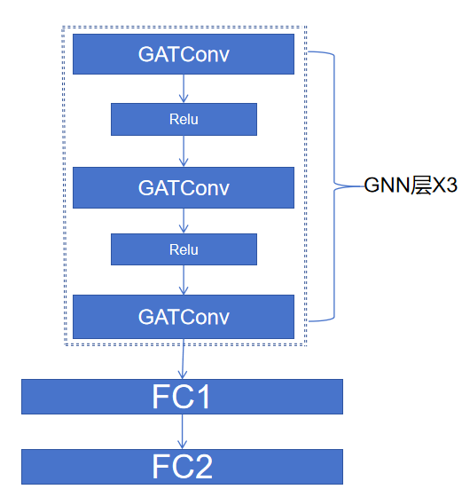

数据集扩充重新划分训练集与预测集的最新结果：

50层lr=0.001     平均差距:0.155869  平均精度:0.927594    精度超过百分之90的数据占比:0.776271 

200 lr=0.001      平均差距:0.149200  平均精度:0.932384    精度超过百分之90的数据占比:0.786441

 下周：.找不以NAS为背景的纯做一个延迟预测器的论文

​           .一种是继续深入用GNN的方式

​             一种是从系统的角度 延迟预测只是其中一部分 

​              需要找温老师深入聊一下（在实验室里的其他设备上测试精度看看有多少，先把延时预测做好再做整体的项目）


11.30-12.14

在一台台式机、树莓派4、jetson xavier nx上部署测试

台式机i5-13600k:

lr=0.001 

optimizer = torch.optim.Adam(net.parameters(), lr=lr,weight_decay=3e-5)

最佳结果：平均差距:0.022470  平均精度:0.940947 精度超过百分之90的数据占比:0.818182


笔记本i7-9750H:

lr=0.001 

optimizer = torch.optim.Adam(net.parameters(), lr=lr,weight_decay=3e-5)

平均差距0.164508  平均精度0.926178 精度超过百分之90的数据占比:0.743243

平均差距0.164779  平均精度0.925897 精度超过百分之90的数据占比:0.751131


树莓派4b：

lr=0.0001 
optimizer = torch.optim.SGD(net.parameters(), lr=lr,weight_decay=3e-5,momentum=0.9)

平均差距:0.196713  平均精度:0.924132  精度超过百分之90的数据占比:0.716763

平均差距:0.195505  平均精度:0.925302  精度超过百分之90的数据占比:0.710983


jetson xavier nx：

lr=0.0001 

optimizer = torch.optim.SGD(net.parameters(), lr=lr,weight_decay=3e-5,momentum=0.9)

平均差距:0.028369  平均精度:0.933546  精度超过百分之90的数据占比:0.737864

平均差距:0.027120  平均精度:0.934047  精度超过百分之90的数据占比:0.805825


**（现在的实现的是超网络的子网络在边缘设备上的延迟可以预测）**

**首先超网络在可能会用到的边缘设备上都测延迟，然后根据超网络和子网络之间的联系直接预测各个边缘设备上跑子网路的延迟**

**问题1：输入输出是什么（已知超网络结构，需要预测的子网路结构，输入超网络在边缘设备上的运行时间和子网络结构，输出：该子网络在指定边缘设备上的延迟）**

**问题2：已知超网络结构预测子网络在边缘设备的延迟该如何实现（现在可以用GNN实现超网络的子网络在边缘设备上的延迟预测）**

**问题3：不同边缘设备上超网络延迟和子网络延迟之间的关系是不是一样的（如果是：如何获取超网络和子网路在边缘设备上延迟的关系）**            


2023.12.21

假设超网络与子网络的关系在不同边缘设备上是相同的

目标：在设备A上采样子网继续训练，实现在设备B上输入子网预测延迟

具体来说就是在设备B上跑超网，通过在设备A上子网的已知延迟，在设备B上实现不需要采样设备B的子网也可以测试设备B上采样子网的延迟。

目前的问题：如何获取超网络和子网络的关系

1.通过建模的方法 

2.训练一个模型获取超网络和子网络的关系

用MLP获取超网络与子网络之间的关系

训练的数据集是设备A上的超网络结构及其对应的延迟、子网路结构及其对应的延迟。

遇到的问题：如果用一个设备的超网络延迟时间进行预测，超网络时间对模型的影响太小了，无法使用。因为用单个设备的数据，该超网络的延迟特征是一个固定值。


2023.12.28-2024 1.4

训练模型的方法

1.将设备A的超网络跑出来的时间融合进GNN的训练数据中

   在训练过程中将子网络的延迟数据与超网络的延迟时间相除，得到一个0到1之间的数作为数据标签

   输出时将0到1之间数与超网络延迟相乘

​    

用笔记本设备作为设备A先进行训练：平均精度:0.940797 精度超过百分之90的数据占比:0.823529


设备B:

​           台式电脑13600K： 平均精度:0.921176 精度超过百分之90的数据占比:0.742268      

​           NX:                           平均精度:0.915836 精度超过百分之90的数据占比:0.668928

​           树莓派4：                平均精度:0.925895 精度超过百分之90的数据占比:0.715732


|                | 不使用子网络数据集进行训练 |                            |      | 使用子网络数据集进行训练 |                            |
| -------------- | -------------------------- | -------------------------- | ---- | ------------------------ | -------------------------- |
|                | 平均精度                   | 精度超过百分之90的数据占比 |      | 平均精度                 | 精度超过百分之90的数据占比 |
| 台式电脑13600K | 0.921176                   | 0.742268                   |      | 0.940947                 | 0.818182                   |
| NX             | 0.915836                   | 0.668928                   |      | 0.941869                 | 0.86394                    |
| 树莓派4        | 0.925895                   | 0.715732                   |      | 0.945528                 | 0.845794                   |


记录：需要找实际的贡献点，需要在实际中解决哪些问题

​            罗列出会影响网络推理延迟的因素，分析看哪些因素是可以研究的


2024 1.11


影响模型推理延迟的因素：

1.边缘设备性能

2.模型结构、模型复杂度

3.不同边缘设备上的优化，推理引擎和框架比如onnx、mnn的优化，算子融合策略


解决的实际问题（可以作为贡献点的）：

1.网络的结构编码方案

2.对看不见的设备上的扩展

3.扩展对于其他超网络的预测

4.延迟预测精度的提升

5.预测的计算开销、计算资源小、轻量级模型

6.自动化剪枝训练GNN

7.训练的模型结构优化

8.建立一个延迟预测数据集的通用格式

9.多模态的延迟预测

10.动态延迟预测，比如设备在工业应用中始终会执行某一个程序，在始终执行这个程序的基础上预测延迟

记录：在服务器上用cuda跑采样子网路，在边缘设备上进行mnn预测

​            边缘设备的图优化


2024 1.18

第一步：pytorch训练模型导出为pt模型

第二部：pt模型转化为onnx模型，onnx模型时间测试用onnxruntime-gpu可用CPU、CUDA测试时间,onnx模型可以通过tensorRT转化为trt模型

第三步：onnx模型转化为mnn模型，mnn模型用cuda跑环境目前搞不好


之前的节点特征获取出现问题，现在已经修改。

1.服务器上的训练数据（用CUDA跑pytorch训练模型导出的pt模型）：平均精度:0.982009       精度超过百分之90的数据占比:1.0

|             | 不使用子网络数据集进行训练 |                            |      | 使用子网络数据集进行训练 |                            | 框架 |
| ----------- | -------------------------- | -------------------------- | ---- | ------------------------ | -------------------------- | ---- |
|             | 平均精度                   | 精度超过百分之90的数据占比 |      | 平均精度                 | 精度超过百分之90的数据占比 |      |
| NX（CPU）   | 0.904358                   | 0.631222                   |      | 0.982119                 | 0.993197                   | MNN  |
| 树莓派(CPU) | 0.902409                   | 0.55296                    |      | 0.967457                 | 0.985981                   | MNN  |

2.NX(cpu)上采样网络训练平均精度0.982119    精度超过百分之90的数据占比0.993197（MNN）

|              | 不使用子网络数据集进行训练 |                            |      | 使用子网络数据集进行训练 |                            | 框架 |
| ------------ | -------------------------- | -------------------------- | ---- | ------------------------ | -------------------------- | ---- |
|              | 平均精度                   | 精度超过百分之90的数据占比 |      | 平均精度                 | 精度超过百分之90的数据占比 |      |
| 树莓派4(CPU) | 0.967294                   | 0.976636                   |      | 0.967457                 | 0.985981                   | MNN  |

MLP：测试结果

精度超过百分之90的数据占比:

0.9392523364485982
0.9532710280373832
0.9473684210526315
0.9543859649122807 
0.9532710280373832
0.9579439252336449 
0.9438596491228071 
0.9368421052631579

超网络结构：


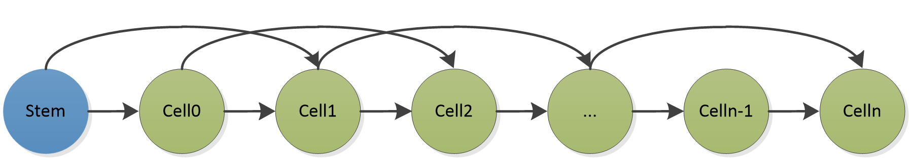

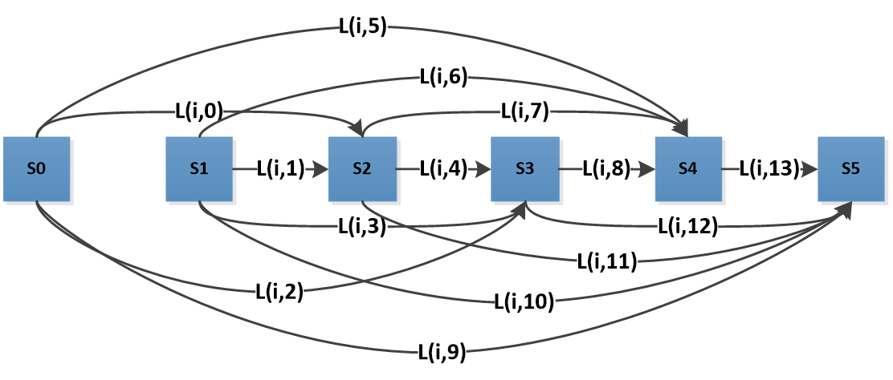

会议记录：超网络与子网络之间的关系可以有哪些，可能会影响跨平台预测的因素。考虑不同软件硬件中网络的不变性


1.对超网络进行剪枝

2.超网络算子操作的变化，改变边的连接方式，更改边权重

3.节点个数的变化

4.上述操作的排列组合


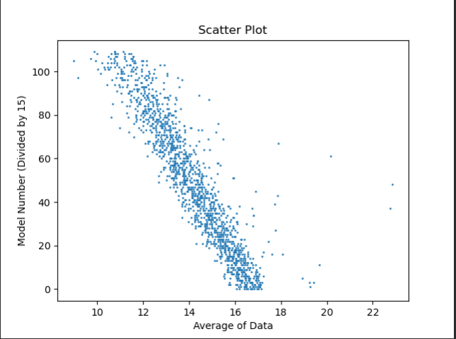

 (1)基于查找表的方法

| FBNet: Hardware-Aware Efficient ConvNet Design via Differentiable Neural Architecture Search | CVPR(2019) | 使用一个延迟查找表模型来估计网络的整体延迟 | 通过对搜索空间中使用的几百个运算符的延迟进行基准测试，我们可以很容易地估计整个搜索空间中1架构的实际运行时间(使用逐层预测器，其通过对模型中的每个操作单独测量的延迟求和来导出延迟) |
| ------------------------------------------------------------ | ---------- | ------------------------------------------ | ------------------------------------------------------------ |
| MnasNet: Platform-Aware Neural Architecture Search for Mobile | CVPR(2019) | 通过在边缘设备上直接执行模型测量延迟       | 我们引入了一种多目标神经架构搜索方法，该方法优化了移动的设备上的准确性和真实世界的延迟。 |
| ChamNet: Towards Efficient Network Design through Platform-Aware Model Adaptation | CVPR(2019) | 为目标设备构建一个LUT，实现快速延迟估计    | LUT由延迟数据库支持，在数据库中有不同输入维度的真实操作延迟（构建一个延迟查找表） |
| ONCE-FOR-ALL: TRAIN ONE NETWORK AND SPECIALIZE IT FOR EFFICENT DEPLOYMENT | ICLR(2019) | 构建一个查找表预测延迟                     |                                                              |
|                                                              |            |                                            |                                                              |

(2)基于GNN的方法

| BRP-NAS: Prediction-based NAS using GCNs                     | NeurIPS（2020） | 一种基于图卷积网络（GCN）的端到端延迟预测器                  | 使用4层GCN，每层有600个隐藏单元，后面是一个完全连接的层，它生成延迟的标量预测。GCN的输入神经网络模型由邻接矩阵A（不对称，因为计算流被表示为有向图）和特征矩阵X（独热编码）编码。我们还引入了一个全局节点（连接到所有其他节点的节点），通过聚合所有节点级信息来捕获神经架构的图嵌入。GCN可以处理任何一组神经网络模型[郑宁新/BRP-NAS (github.com)](https://github.com/zheng-ningxin/brp-nas#Device-measurement) |
| ------------------------------------------------------------ | --------------- | ------------------------------------------------------------ | ------------------------------------------------------------ |
| A Generic Graph-Based Neural Architecture Encoding Scheme for Predictor-Based NAS | ECCV(2020)      | 提出了GATES，一个基于图的神经架构编码器GATES显着提高了架构性能预测 | GATES模型的操作是传播信息的转换                              |
|                                                              |                 |                                                              |                                                              |
| Bridge the Gap Between Architecture Spaces via A Cross-Domain Predictor | NeurIPS（2022） | 出了一个跨域预测器（CDP），使用了GCN预测性能                 | 提出了一个渐进的子空间自适应策略，以解决源架构空间和目标空间之间的域差异。考虑到两种建筑空间差异较大，设计了一个辅助空间，使转换过程更加顺畅。 |
| COBRA: ENHANCING DNN LATENCY PREDICTION WITH LANGUAGE MODELS TRAINED ON SOURCE CODE | ICLR(2022)      | 基于源代码的图神经网络延迟预测                               | 基于源代码的延迟预测利用一个Transformer编码器来学习短代码段的表示,表示由图卷积网络（GCN）聚合，该图卷积网络捕获算法依赖性并估计所实现的DNN的延迟. |
|                                                              |                 |                                                              |                                                              |
|                                                              |                 |                                                              |                                                              |

(3).基于kernels的方法

| nn-Meter: Towards Accurate Latency Prediction of Deep-Learning Model Inference on Diverse Edge Devices | MobiSys（2021） | 准确预测DNN模型在不同边缘设备上的推理延迟                    | nn-Meter的关键思想是将整个模型推理划分为内核，即，设备上的执行单元，并进行内核级预测。nn-Meter基于两个关键技术构建：（i）内核检测，通过一组设计良好的测试用例自动检测模型推理的执行单元;以及（ii）自适应采样，以从大空间中有效地采样最有益的配置，从而构建准确的内核级等待时间预测器。 |
| ------------------------------------------------------------ | --------------- | ------------------------------------------------------------ | ------------------------------------------------------------ |
| nnPerf: A Real-time On-device Tool Profiling DNN Inference on Mobile Platforms | SenSys （2023） | 实时的设备上分析器，旨在收集和分析移动平台上的DNN模型运行时推理延迟 |                                                              |
| NN-Stretch: Automatic Neural Network Branching for Parallel<br/>Inference on Heterogeneous Multi-Processors | MobiSys（2023） | 提出一种新的模型自适应策略适应异构处理器，使用了nn-meter延迟预测器 |                                                              |

（4）基于元学习的方法

| HELP: Hardware-Adaptive Efficient Latency Prediction for NAS via Meta-Learning | NeurIPS（2021） | 提出了硬件自适应有效延迟预测器（HELP） | 将延迟预测问题形式化为一个few-shot回归任务，即给定一个架构-设备对，估计其延迟，利用每个设备上参考架构的延迟作为参考，提出了一个元学习框架，将经验元学习与基于梯度的元学习相结合，以学习跨多个设备泛化的延迟预测模型。 |
| ------------------------------------------------------------ | --------------- | -------------------------------------- | ------------------------------------------------------------ |
|                                                              |                 |                                        |                                                              |
|                                                              |                 |                                        |                                                              |

（5）基于Transformer的方法

| NAR-Former: Neural Architecture Representation Learning towards Holistic Attributes Prediction | CVPR(2023) | 通过Transformer架构和自注意力机制，实现对神经网络全面属性的预测 | 提出了一个有效的神经架构表示学习框架，该框架由线性缩放网络编码器，基于transformers的表示学习模型，以及一个有效的模型训练方法与数据增强和辅助损失函数组成。 |
| ------------------------------------------------------------ | ---------- | ------------------------------------------------------------ | ------------------------------------------------------------ |
|                                                              |            |                                                              |                                                              |


（6）基于回归模型的方法

|                                                              |                 |                                                              |                                                              |
| ------------------------------------------------------------ | --------------- | ------------------------------------------------------------ | ------------------------------------------------------------ |
| FOX-NAS: Fast, On-device and Explainable Neural Architecture Search | ICCV(2021)      | 采用多变量回归分析作为预测器，比深度学习方法减少了时间和数据 | 采用多元回归来生成性能预测因子,与基于深度学习的方法相比，多元回归分析可以更好地理解每个变量对结果的影响，并以更少的数据创建有希望的预测器 |
|                                                              |                 |                                                              |                                                              |
| MAPLE: Microprocessor A Priori for Latency Estimation        | CVPR（2022）    | 微处理器先验延迟估计（MAPLE）                                | 提出了一个延迟预测技术，采用了一个紧凑的基于神经网络的非线性回归模型的延迟推理，通过测量10个关键性能指标，包括缓存效率，计算速率和指令数等来表示目标硬件。回归模型是硬件感知和DNN架构感知的，因为它接受硬件描述符和DNN架构编码作为输入。 |
| MAPLE-Edge: A Runtime Latency Predictor for Edge Devices     | CVPR(2022)      | MAPLE针对嵌入式设备的改进版，提出了一种新的使用LPM算法优化边缘运行时间的延迟估计器。 | MAPLE-Edge是一种基于硬件回归模型的LPM方法，可以准确估计深度神经网络架构在看不见的嵌入式目标设备上的推理延迟。精度优于MAPLE和HELP |
| CoDL: Efficient CPU-GPU Co-execution for Deep Learning Inference on Mobile Devices | MobiSys(2022)   | 提出轻量但精确的非线性和并发感知延迟预测。（在cpu和gpu上的精度分别为83.21%和82.69%） | 考虑cpu与gpu协同计算的数据共享开销，考虑由平台特征引起的非线性延迟响应，以数据大小和给定的处理器上执行基本单元的时间使用极轻量线性回归模型来学习非线性模型。 |
| Sniper: cloud-edge collaborative inference scheduling with neural network similarity modeling | DAC (2022)      | 开发了一种基于神经网络相似性（NNS）的非侵入性性能表征网络（PCN），以准确预测DNN的推理时间。 |                                                              |
| Runtime WCET Estimation Using Machine Learning               | mobicom（2023） | 使用多层感知器（MLP）神经网络的执行时间和作业序列数据。利用MLP𝜇𝑠将技术集成到系统中，优化资源分配和调度 |                                                              |
| AdaptiveNet: Post-deployment Neural Architecture<br/>Adaptation for Diverse Edge Environments | mobicom（2023） | 关于边缘设备模型部署论文，提出一种方法，不在云设备上进行超网的剪枝等操作，而是直接在边缘设备上对超网进行修改得到合适的子网。提出一种基于重用的模型评估方法，该方法将中间特征缓存在候选模型中，以减少每次迭代中评估模型所需的时间。 | 提出预测器在边缘分布上可能不可靠，导致次优模型生成。         |

延时预测器论文总结：

方向一：着重点在于制作延迟预测器。

 （1）最初是的FBNet、ChamNet等论文使用查找表的方式，nn-meter则是基于kernels基础上使用查找表

 （2）使用基于模型的方法，用黑盒的方式预测延迟，比如BRP-NAS、GATES、CDP一系列使用GNN的方式，FOX-NAS、MAPLE、MAPLE-Edge等使用其他回归网络的方式

方向二：在一个系统中使用延迟预测器（找到最佳结构或者利用延迟进行其他研究）

 （1）在CoDL中，考虑cpu与gpu协同计算的数据共享开销和平台特征引起的非线性延迟响应。

 （2）Runtime WCET Estimation Using Machine Learning文章结合神经网络的执行时间和作业序列数据使用多层感知器（MLP）预测延迟。利用MLP𝜇𝑠将技术集成到系统中，优化资源分配和调度。

 （3）AdaptiveNet中提出了一种基于重用的模型评估方法，该方法将中间特征缓存在候选模型中，以减少每次迭代中评估模型所需的时间。


2.24.3.12

1.论文Sniper中基于神经网络相似性预测推理延迟，计算关键特征和推理时间的皮尔逊相关系数，将得到的各个皮尔逊相关系数进行线性残差拟合。

   关键特征包括：总计算量、卷积层数（3x3）、卷积层数（1x1，5x5）、关键路径网络参数个数、关键路径网络参数比例

1.两个网络的关系在不同环境下是否保持不变？

   假设在不同环境下两个网络之间都有一定关系

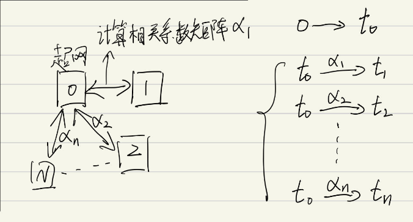


1.每一个子网和超网的相关系矩阵都是唯一的

2.通过多个相关系数矩阵和对应延迟所占超网的百分比系数作为数据集训练出一个模型

   目的：输入相关系数矩阵输出对应百分比系数

输入关系矩阵和超网在设备上的延迟得到对应子网在设备上的延迟


3.19

根据给定的超网和目标延迟直接输出由超网产生的子网

1.网络结构如何构建为Transformer输入的序列 编码和解码方式

找到了一篇使用Transformer和GNN结合的进行延迟和精度预测的论文

论文：NAR-Former V2: Rethinking Transformer for Universal Neural Network Representation Learning（2023 ）

论文中将原本输入Transformer的特征结合了GNN输入的方式，让Transformer输入的序列中融合了图的信息。

2.如果告诉gpt网络结构要求输出相应延迟的网络，我们的贡献体现在什么方面？

3.训练一个直接输出网络结构的模型，数据集要如何构建


3.26

输入文字输出图像

论文：Hierarchical Text-Conditional Image Generation with CLIP Latents

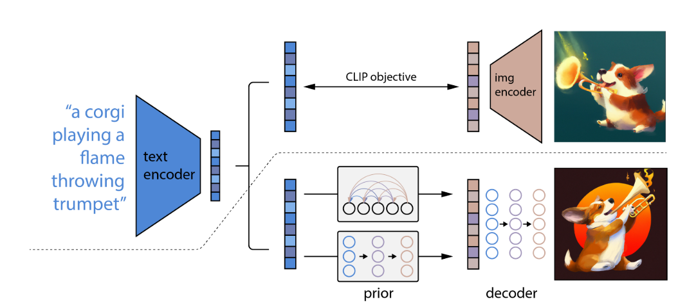

# Parti:

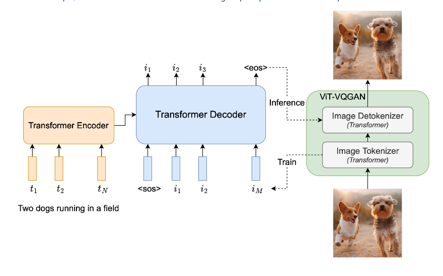

论文：NAR-Former V2: Rethinking Transformer for Universal Neural Network Representation Learning（2023 ）

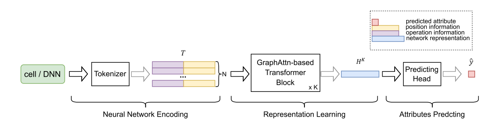


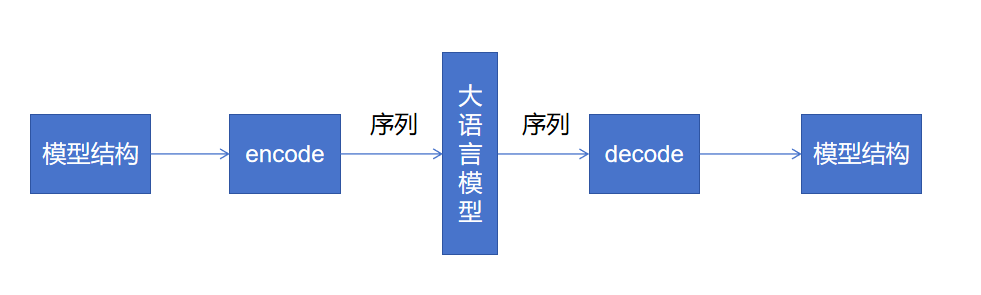

大模型微调策略：

输入txt：要求的模型在某个硬件的延迟

输出特征：模型结构encode之后对应的序列

once for one


**3.27会议纪要**：

方向：用大模型（或者其他方式）生产网络结构，再将网络结构放入NAR-Former V2的预测器中进行判别选出符合要求的结果

接下来的调研内容：NAS中的精度预测，NAS中网络结构的生成方式

首先确定输入输出

我们需要什么能力

大模型能够提供什么能力

构建出一个训练的框架 


NAS的定义：寻找最优的神经网络结构，使得验证集准确率最大化，同时考虑计算量和内存开销

BRP-NAS:使用延迟预测器的GCN部分，输入两个模型，判别哪一个模型精度更高。

NAS的流程：1.搜索空间 神经网络的超参数

​                       2.搜索策略 

​                       3.性能评估方法

Progressive NAS:：一层一层渐进式的方式决定在每一层要用什么样的选择

One-shot NAS：训练一个巨大的模型，该模型包括需要考虑的大部分模型，子模型

Differentiable NAS：利用梯度信息来指导搜索过程，以寻找最优的神经网络结构


1.NAS中的精度预测：

1）进行相对的性能预测得到一个架构之间性能的排名，如ReNAS、BRP-NAS中的精度部分

2）设计一个指标，根据指标判断模型精度，如EPE-NAS

3）直接对精度进行预测

2.NAS中网络结构的生成方式：给定一个搜索空间，在该搜索空间中执行搜索策略，搜索策略中包含了对搜索到的神经网络架构的性能预测，输出最优模型。这个网络的生成方式是一个整体。


与NAS相比，NAS是在一个搜索空间中执行搜索策略，训练时的搜索空间是101或者201，后续把策略扩展在更大的空间中，每次找一个模型都需要执行一整套的搜索流程。

我们的模型在训练完之后，在搜索空间中只需要运行一次就直接得出结果，首先从单个模型的结果中不比NAS差，其次可以快速的多次输入输出。


确定输入输出：输入延迟和精度要求，以及网络结构，输出符合要求的网络结构。

我们需要什么能力：需要网络架构生成器，网络性能判别器。

大模型可以提供的能力：本质是序列到序列的映射，通过喂架构和延迟可以做到输入架构输出延迟。


我们需要大模型提供的能力：根据我对输入的限制，生成的模型，对生成模型的要求不是很高，后续可以通过判别器筛选。

选用的判别器：NAR-Former V2 延迟用的预测集是NNLOP中的[ModelTC/NNLQP (github.com)](https://github.com/ModelTC/NNLQP)，精度预测用的是NAS-Bench-101 和NAS-Bench-201 （精度评估预测序列与真实的序列之间的相关性。

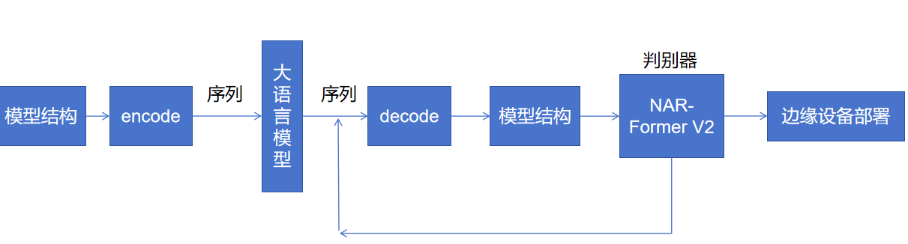

1.大语言模型生成模型架构的训练方式，如何设置数据集？在使用NAR-Former V2 的前提下，大语言模型的训练中如果也使用相同或者有包含关系的数据，是否可以？

2.NAR-Former V2预测大模型生成的模型架构（复现NAR-Former V2   直接用或者重新训练）？

3.把生成器和判别器连接，后续包装。


总体模型结构：

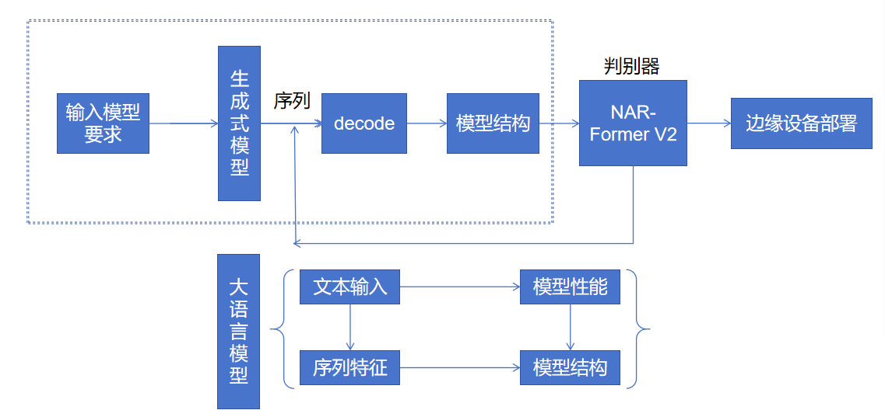

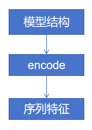


1.数据集构建方式，假设复现NAR-Former V2，生成式模型中用来生产模型结构的数据集用哪个？


总体步骤：

1.复现性能预测器，直接用他们的数据集

2.根据性能预测器中的数据集，拟定输入大模型的模型结构编码方式

T =（t1，t2，· · ·，tN）∈ RN×C。每个向量封装操作和位置信息：ti =（top i，tpos i）∈ RC。

论文：ONE FOR ALL: TOWARDS TRAINING ONE GRAPH MODEL FOR ALL CLASSIFICATION TASKS

提出了文本属性图，通过用自然语言描述节点和边来统一不同的图数据，并使用语言模型将不同的和可能跨域的文本属性编码为同一嵌入空间中的特征向量。


**4.9**

1.onnx模型通过encoder转化为节点特征、边集特征、静态特征（模型参数特征，batch_size\flops等参数）


一个onnx模型Encoder之后的结果：

Data(x=[21, 152], edge_index=[2, 40], y=[1]) tensor([8.4147e-01, 5.4030e-01, 1.5783e-01, 9.8747e-01, 2.5116e-02, 9.9968e-01,

​    3.9811e-03, 9.9999e-01, 6.3096e-04, 1.0000e+00, 9.7766e-01, 2.1020e-01,

​    2.1373e-01, 9.7689e-01, 3.4130e-02, 9.9942e-01, 5.4103e-03, 9.9999e-01,

​    8.5748e-04, 1.0000e+00, 8.2304e-02, 9.9661e-01, 1.3059e-02, 9.9991e-01,

​    2.0697e-03, 1.0000e+00, 3.2803e-04, 1.0000e+00, 5.1989e-05, 1.0000e+00,

​    8.3222e-02, 9.9653e-01, 1.3205e-02, 9.9991e-01, 2.0929e-03, 1.0000e+00,

​    3.13170e-04, 1.0000e+00, 5.2570e-05, 1.0000e+00])


LLM选择：[Qwen/README_CN.md at main · QwenLM/Qwen (github.com)](https://github.com/QwenLM/Qwen/blob/main/README_CN.md)

数据集微调格式：

```
[
  {
    "id": "identity_0",
    "conversations": [
      {
        "from": "usr",
        "value": "A network structure with an output delay of 10ms and an accuracy of 0.8"
      },
      {
        "from": "assistant",
        "value": "Data(x=[21, 152], edge_index=[2, 40], y=[1])，fs"
      }
    ]
  }
]
```

2.decoder：将onnx模型重构出来

​    根据图特征反向重构onnx模型工作量太大。

​    根据LLM的输出序列的特征重构成onnx模型难度太大


4.16

已经实现：

1.通过读取onnx模型获取每一个节点信息

2.根据读取的节点信息转化成大模型训练的数据集格式（还需要微调）

3.大模型QWEN本地训练环境目前可以跑7B的模型

遇到的问题：

1.在不做修改的情况下大模型的输出是文本，如何处理成我们需要的模型输出

2.可以用的服务器（A5000）集群（A100）,集群的环境搭建需要使用docker，目前以及在本地运行成功需要把环境打包成docker

0.5B  1.5B  7B  15B  72B


解决问题1的思路：

1.继续使用原先的思路继续微调训练，查看输出格式是否能处理

备选方案2.可以使用大模型可以输出代码的能力，让模型输出py文件，运行这个文件来生成代码


4.18小会：


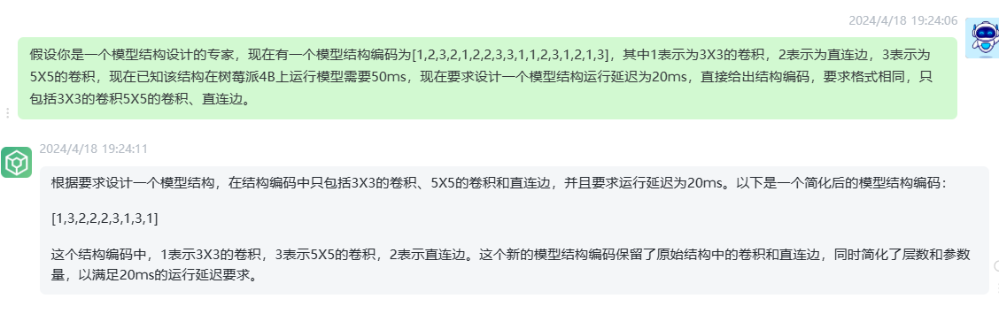

4.22-5.7

0.5B的模型训练中loss不收敛

14B模型训练：

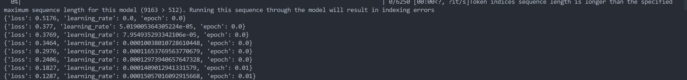


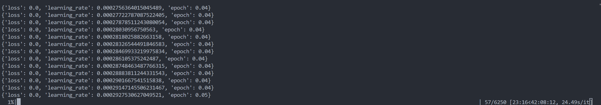

loss降低到0是 LOSS降低到0的原因是数据集有BUG

14B的模型训练一个epoch的输出：

自动输入 generate a pytorch model whose latency is 1.01264ms
{'op_type': 'Conv', 'input': ['data', 'learned_0', 'learned_1'], 'output': ['17'], 'attribute': [['name: "dilations"', 'ints: 1', 'ints: 1', 'type: INTS'], ['name: "group"', 'i: 1', 'type: INT'], ['name: "kernel_shape"', 'ints: 3', 'ints: 3', 'type: INTS'], ['name: "pads"', 'ints: 0', 'ints: 0', 'ints: 0', 'ints: 0', 'type: INTS'], ['name: "strides"', 'ints: 4', 'ints: 4', 'type: INTS']]}
{'op_type': 'Relu', 'input': ['17'], 'output': ['18']}
{'op_type': 'MaxPool', 'input': ['18'], 'output': ['19'], 'attribute': [['name: "kernel_shape"', 'ints: 3', 'ints: 3', 'type: INTS'], ['name: "pads"', 'ints: 0', 'ints: 0', 'ints: 0', 'ints: 0', 'type: INTS'], ['name: "strides"', 'ints: 2', 'ints: 2', 'type: INTS']]}
{'op_type': 'Conv', 'input': ['19', 'learned_2', 'learned_3'], 'output': ['20'], 'attribute': [['name: "dilations"', 'ints: 1', 'ints: 1', 'type: INTS'], ['name: "group"', 'i: 1', 'type: INT'], ['name: "kernel_shape"', 'ints: 5', 'ints: 5', 'type: INTS'], ['name: "pads"', 'ints: 2', 'ints: 2', 'ints: 2', 'ints: 2', 'type: INTS'], ['name: "strides"', 'ints: 1', 'ints: 1', 'type: INTS']]}
{'op_type': 'Relu', 'input': ['20'], 'output': ['21']}
{'op_type': 'MaxPool', 'input': ['21'], 'output': ['22

自动输入 generate a pytorch model whose latency is 0.541235ms
{'op_type': 'Conv', 'input': ['data', 'stem.net.0.weight', 'stem.net.0.bias'], 'output': ['375'], 'attribute': [['name: "dilations"', 'ints: 1', 'ints: 1', 'type: INTS'], ['name: "group"', 'i: 1', 'type: INT'], ['name: "kernel_shape"', 'ints: 3', 'ints: 3', 'type: INTS'], ['name: "pads"', 'ints: 1', 'ints: 1', 'ints: 1', 'ints: 1', 'type: INTS'], ['name: "strides"', 'ints: 1', 'ints: 1', 'type: INTS']]}
{'op_type': 'Relu', 'input': ['375'], 'output': ['376']}  
{'op_type': 'Conv', 'input': ['376', 'stack_cell1.0.options.8.op.1.weight', 'stack_cell1.0.options.8.op.1.bias'], 'output': ['377'], 'attribute': [['name: "dilations"', 'ints: 1', 'ints: 1', 'type: INTS'], ['name: "group"', 'i: 1', 'type: INT'], ['name: "kernel_shape"', 'ints: 1', 'ints: 1', 'type: INTS'], ['name: "pads"', 'ints: 0', 'ints: 0', 'ints: 0', 'ints: 0', 'type: INTS'], ['name: "strides"', 'ints: 1', 'ints: 1', 'type: INTS']]}
{'op_type': 'AveragePool', 'input': ['375'], 'output': ['378'], 'attribute': [['name: "ceil_mode"', 'i: 0', 'type: INT'], ['name: "kernel_shape"', 'ints: 3', 'ints: 3', 'type: INTS'], ['name: "pads"', 'ints: 1', 'ints: 1', 'ints: 1', 'ints: 1', 'type: INTS'], ['name: "strides"', 'ints: 1', 'ints: 1', 'type: INTS']]}

将输出转化为onnx模型之后放入nar检测延迟，单个手动版本

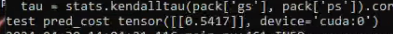

4.30和王聪老师的会议记录：

是否合适投infocom
为什么要使用大模型和其他的方法比
考虑真实设备复杂的情况
可以考虑加更多的信息（比如 考虑内存的限制 ）
baseline要做起来    从任务角度出发  用和NAS的方法作比较


遇到的问题：

在数据集制作过程中直接读取onnx模型，onnx中的算子有一部分是pytorch中不存在的，可能是其他框架生成之后转成onnx，导致根据输出生成pytorch失败。


工作流程：

1.优化数据集，限制输入输出格式

2.输出的模型结构数据数据转化为onnx模型

3.用nar验证模型性能，训练生成的模型在实际设备上测试

4.（可选）loss中加入精度以及延迟的权重


