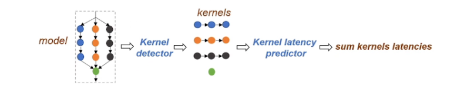
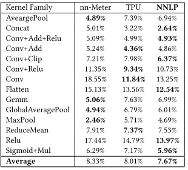
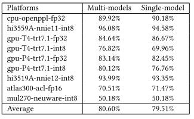
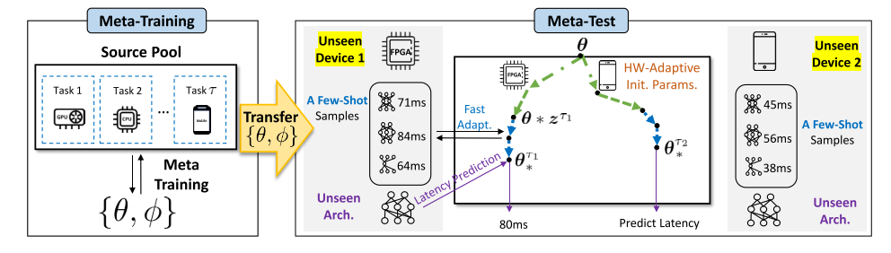
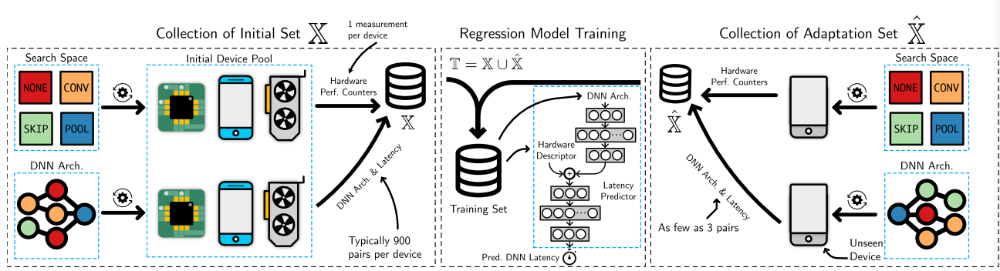
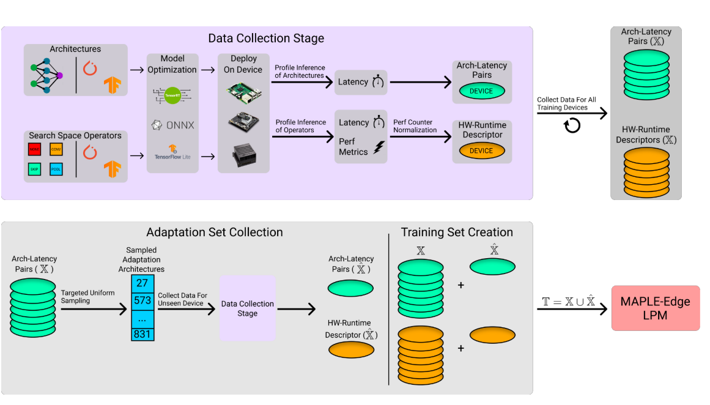

1111111

**延时预测器的作用：预测模型在边缘设备上的推理延时**

​          1.**基于FLOPs评估模型**，即计算卷积神经网络推理过程中浮点计算次数。

​             缺点：不能精确的表示推理延迟

​          2.**构建延时查找表**，测出每个算子的推理延时，构成一个查找表，每个算子对应一个推理延时，剪枝时候求出剩下算子的延时相加。 

​             缺点：查找表的方法没有考虑边缘设备推理过程中的优化-算子融合，导致误差很大，性能不高

​           3.**nn-meter 基于核的延迟预测器**

​                           1.核规则检测

​                           不同的平台有不同的核规则，通过产生不同算子融合规则的测试用例检测移动平台的核规则。

​                           2.核数据生产

​                           在获得了移动设备的核规则之后，收集相关核在移动设备上的推理时间。

​                           3.回归模型训练

​                           在收集到足够的核样本数据之后，分为测试集和训练集，然后通过训练回归网络获取核延迟预测器。

​                          4.将每一个核的推理时间相加。

​                         优点：误差小，精度高，可以添加自定义后端（可以检测其他的硬件）

​                          缺点：1.核规则检测速度慢，对每一个边缘硬件都需要检测一遍核规则，如果边缘设备种类不同则需要检测的成本很高。

​                                     2.通过递归所检测出来的核规则在某一些硬件平台上无法证明算子融合规则的正确性。

​          

​            4.   通过图神经网络（GNN）模型推理延迟预测器**。用GNN学习模型图和相应推理延迟。问题在于图卷积神经网络的方法严重依赖于训练集的模型结构，对于没有学习过的模型泛化性很差。

​                                  1.延迟数据集采集，在边缘设备上推理模型，记录推理时间，作为后续训练性能预测器的数据集。

​                                           （1）先训练一个用于被剪枝的模型

​                                           （2）写算法对模型进行剪枝

​                                           （3）跑模型 记录推理延迟

​                                           （4）整理数据集格

​                                 2.训练性能预测器

​                                 3.使用性能预测器

对于使用图神经网络BRP-NAS

​      优点：1.通过图神经网络可以同时预测延迟和精度

​                  2.一个端到端的性能预测器，使用方便。

​      缺点：1.依赖于训练集的模型结构，对于没有学习过的模型泛化性很差。

​                  2.静态数据集，性能无法更新。

针对BRP-NAS和nn-meter中的缺点，NNLQP论文中提出了一个多平台的神经网络延迟查询和预测系统（NNLQP）与一个不断发展的数据库。

用了GraphSAGE，不太懂这个方法。

NNLQP

​                                                                                                                          与nn-meter相比较

​                                                                                                                             单头多头的比较

​          优点：1. 平台上的各种模型的延迟知识在数据库中不断积累。可以设计和训练高精度的延迟预测器，并通过不断发展的数据库不断改进新的模型结构和平台。

​                     2. 通过NNLQP数据库中丰富的、不断演化的数据，设计了一种统一的图嵌入方法，避免了核函数求和的不准确性

​                     3. 使用多头运算，一个头预测一个硬件的延迟，同时预测多个平台的延迟

​         缺点：“目前没看出啥”

  5.通过元学习实现NAS的硬件自适应高效延迟预测（HELP）

​        优点：1.用几个样本来估计模型在看不见的设备上执行给定任务的延迟

​          缺点：1.需要10个测量样本以获得比较高的性能

​     6.MAPLE：利用硬件特征来预测以前看不见的硬件设备上的深度神经网络延迟，MAPLE利用CPU和GPU之间的紧密I/O耦合，使用CPU性能监控事件来表示GPU硬件。测量仅3个随机选择的架构的延迟，通过将三个自适应样本混合到初始集合中来形成训练集合，延迟预测器被实现为基于神经网络的回归模型，该回归模型它接受硬件描述符和 DNN体系结构编码作为输入。

​        通过搜集基于CPU缓存效率、计算速度和内存I/O等硬件指标和DNN架构进行回归模型训练，对于未知硬件，MAPLE还可以测量一组已知设备上的初始DNN架构的延迟，从而实现对未知DNN架构的泛化。

优点：1.只需要采集三个样本就可以在新的硬件上进行预测

缺点：1.各种运行时环境上，比如在嵌入式设备中（包括高度优化的运行时环境）无法准确地估计神经网络架构推理延迟

​       MAPLE-Edge:   与MAPLE相比，MAPLE- edge可以使用更小的CPU性能计数器来描述运行时和目标设备平台，这些计数器在所有Linux内核上都可以广泛使用。专门为嵌入式设备设计。通过在几分钟内（而不是几天）仅通过运算符级别的特征来表示硬件设备和运行时环境，提出的MAPLE-Edge算法能够准确估计在经过优化且以前未见过的运行时上执行的神经网络架构的端到端延迟。

优点：1.适用于嵌入式设备

​            2.可以快速表示新的硬件设备和运行环境

​     ![image-20231109211545291](一些图片/image-20231109211545291.png

